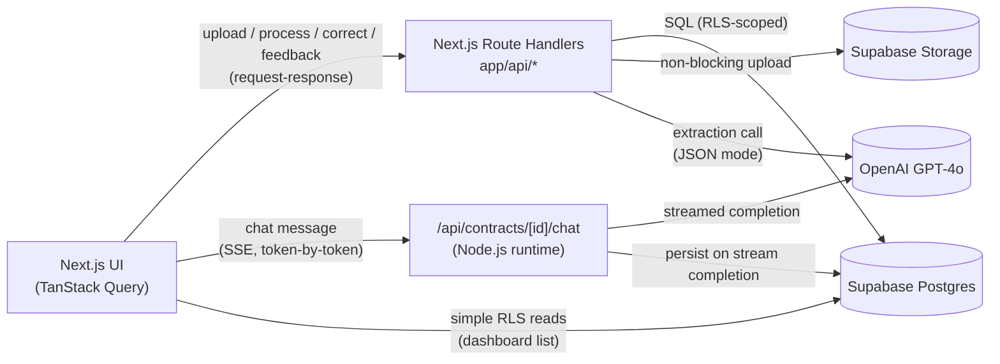

# ContractIQ — Engineering Document

**Status:** Approved for Stage 2 (Implementation Specs) once reviewed
**Source:** `docs/ContractIQ_PRD.md` (v1.0, June 24, 2026)
**Scope:** MVP (Roadmap v0.1 → v1.0), NDA + MSA contract types only

This document is the authoritative architecture reference for ContractIQ. It resolves every open architectural question left by the PRD and states explicit assumptions wherever the PRD is silent, so that no implementation decision is left to chance in later stages.

**Three architecture decisions made in this document that go beyond — or supersede — the PRD's literal text:**

1. **Backend API is Next.js Route Handlers** (`app/api/*`), deployed on Vercel in the same project as the frontend. The PRD (Section 6) hedges between "Supabase Edge Functions or a hosted Node.js API" — this document picks Route Handlers as final. No Supabase Edge Functions exist in this architecture.
2. **Server-state management is TanStack Query.** All fetching/caching/invalidation for contracts, key terms, chat messages, and dashboard data goes through TanStack Query. Client-only UI state (modals, active PDF page, panel visibility) uses plain React state/Context. The PRD does not specify a state library — this is a net-new decision.
3. **Contract Chat streams via Server-Sent Events (SSE)** from a Route Handler, token-by-token. This **supersedes** the PRD's Section 6 text, which mentions "Supabase Realtime subscriptions... for chat message streaming." Supabase Realtime is **not** used anywhere in this architecture — persistence to `chat_messages` happens once the SSE stream completes, and history reloads (US-012) go through a normal TanStack Query fetch.

---

## 1. Executive Summary

**Project:** ContractIQ — an AI-assisted contract review tool that extracts key terms from NDAs and MSAs with page-level attribution and confidence scoring, and lets users ask follow-up questions about the contract in plain English.

**Problem:** SMB founders, ops leads, and freelancers routinely sign NDAs and MSAs without in-house legal support. Manual review takes 90–120 minutes per contract and frequently misses key obligations (auto-renewal, indemnification caps, IP assignment). Generic AI chat tools give unstructured summaries with no page reference, no confidence score, and no correction loop.

**Target users:**
- **Primary — Time-Pressed Founder / Ops Lead:** SaaS/agency/professional-services companies, 5–250 employees, no in-house legal counsel, signs 5–15 NDAs/MSAs per month.
- **Secondary — Freelancer / Consultant:** receives 1–4 MSAs/month from larger clients, can't afford legal review, no leverage to push back on unfamiliar clauses.

**Success criteria (from PRD Section 3, verbatim targets):**
- **North Star:** average time from upload to completed key-term review ≤ 15 minutes (baseline: 90 minutes manual).
- Key-term extraction accuracy ≥ 88% F1 (NDA) / ≥ 85% F1 (MSA) on the labelled eval set.
- Confidence-score calibration within ±10% of actual accuracy.
- Time to first extracted key-term display ≤ 30 seconds P95 for contracts ≤ 20 pages.
- 30-day retention ≥ 45%; cost per contract analysis ≤ $0.25.

**Stack summary:** Next.js (App Router, TypeScript) frontend and Route Handler backend deployed together on Vercel; Supabase for Postgres, Auth, and Storage; OpenAI GPT-4o for extraction and chat; PDF.js for client-side rendering; TanStack Query for all server-state.

**Scope boundary:** MVP supports only NDA and MSA contracts, English-language, US/UK law, text-layer PDFs ≤ 20 pages / 10 MB / ≤ 15,000 tokens. This is not a general CLM platform and does not handle scanned PDFs, non-English contracts, or contract types outside NDA/MSA.

---

## 2. Product Scope

### In Scope (MVP — Roadmap v0.1 through v1.0)

| Capability | PRD Reference |
|---|---|
| Email/password sign up, sign in, sign out | FR-01, US-001 |
| PDF upload with 10 MB / 20-page validation | FR-02, US-002 |
| Server-side text extraction with `[PAGE N]` markers, stored once in `contracts.contract_text` | FR-03 |
| Key terms panel: term name, value, page number, confidence score | FR-04, US-004 |
| Custom key term addition (max 5 per contract) | FR-05, US-005 |
| Page-number attribution, click-to-navigate | US-003, FR-07 |
| Inline PDF viewer (PDF.js) with text-viewer fallback | FR-06, US-006 |
| Contract chat grounded in document text, page citation | FR-08, US-007 |
| Persistent chat history per contract | FR-09, US-012 |
| Dashboard with sortable contract history | FR-10, US-008 |
| Low-confidence (< 50%) warning flag, non-dismissible tooltip | FR-11 |
| Inline key-term correction with "Edited" badge | US-009 |
| Thumbs up/down feedback with optional comment | FR-12, US-010 (P2) |
| Row-level security on all tables | FR-13 |
| Single paste-and-run SQL setup (tables, RLS, Storage bucket + policies) | FR-14 |

### Out of Scope (MVP)

| Excluded | Why / PRD Basis |
|---|---|
| Scanned/OCR PDFs | Constraint §5, Assumption 3 — graceful error only; OCR deferred to v1.2 |
| Non-English / non-US-UK contracts | Assumption 2, HHH Fairness section |
| Contract types beyond NDA/MSA | Scope statement, title page |
| CSV / PDF export | US-011, P2/Backlog — deferred to v1.1 |
| Batch upload (multiple contracts at once) | Roadmap v1.1 |
| Dashboard analytics charts | Roadmap v1.1 |
| Contract comparison view | Roadmap v1.2 |
| Multi-user / team workspaces | Roadmap v1.2 |
| Email notifications on processing completion | Roadmap v1.2 |
| Billing / plan-tier enforcement (Stripe or similar) | **Assumption:** Section 12 pricing tiers are explicitly "directional only" (Assumption 12) and are never referenced by any FR. No payment integration exists in MVP scope. |
| Admin / internal support UI | Not mentioned anywhere in the PRD. **Assumption:** internal support uses direct Supabase dashboard access, not an in-app admin panel. |

### Future Enhancements

- **v1.1 (weeks 15–18):** Export key terms to CSV; export summary to PDF; batch upload (≤ 5 contracts); dashboard analytics (contracts by month, correction rate).
- **v1.2 (weeks 19–24):** Scanned PDF support via OCR (AWS Textract or equivalent — PRD leaves the OCR vendor undecided); contract comparison view (2 contracts side-by-side); email notifications; multi-user workspace (team plans, ties to the Pro tier's "up to 5 seats").

---

## 3. User Personas

### Primary — Time-Pressed Founder / Ops Lead
- **Role:** Founder, COO, Procurement Manager, Legal Operations Manager
- **Company:** 5–250 employees, no in-house legal counsel
- **Behavior:** signs 5–15 NDAs/MSAs per month
- **In-app responsibilities:** uploads contracts, selects contract type, adds custom terms, reviews/corrects extracted key terms, uses chat, manages dashboard history
- **Permissions:** standard authenticated user, RLS-scoped strictly to their own `user_id`

### Secondary — Freelancer / Consultant
- **Role:** individual contributor signing client contracts
- **Behavior:** receives 1–4 MSAs/month, often signs without full review due to power imbalance with larger clients
- **In-app responsibilities and permissions:** identical to the primary persona — **the PRD draws no functional or permission distinction between the two personas**, only a difference in usage frequency and context. This document does not invent a tiered-permission system.

### No Admin / Internal-Support Persona
**Assumption:** the PRD defines no admin or support role. MVP ships with exactly one user role. Any internal support or operations access happens via direct Supabase dashboard access with service-role credentials, not an in-app admin panel.

Both personas share the same four primary workflows (Section 4): sign-up → dashboard, returning-user dashboard, core contract review, and contract chat. There is no persona-specific flow branching anywhere in the PRD.

---

## 4. User Flows

Format: `User Action → Frontend Behavior → Backend Processing → Database Interaction → System Response`

### Flow A — New Visitor → Sign Up → Dashboard (PRD Flow 1)

| Step | User Action | Frontend Behavior | Backend Processing | Database Interaction | System Response |
|---|---|---|---|---|---|
| 1 | Lands on marketing page, clicks "Get Started Free" | Opens Supabase Auth sign-up modal (email + password) | Supabase Auth handles registration directly from the client SDK — no custom Route Handler needed | Supabase Auth creates a row in `auth.users` | Modal closes on success |
| 2 | — | Client SDK receives session; Next.js middleware (`middleware.ts`) sets the session cookie via `@supabase/ssr` | — | — | Redirect to `/dashboard` |
| 3 | Lands on Dashboard | TanStack Query (`['contracts']`) fetches contract list, returns empty array | — | `SELECT * FROM contracts WHERE user_id = auth.uid()` returns 0 rows | Empty state: "No contracts reviewed yet — upload your first contract to begin" |

### Flow B — Returning User → Dashboard (PRD Flow 2)

| Step | User Action | Frontend Behavior | Backend Processing | Database Interaction | System Response |
|---|---|---|---|---|---|
| 1 | Signs in | Supabase Auth client SDK authenticates | Session cookie set via middleware | Supabase Auth validates credentials | Redirect to `/dashboard` |
| 2 | Dashboard loads | TanStack Query `useQuery(['contracts', userId])` and `useQuery(['dashboardStats', userId])` fetch data; results are cached so re-navigating to the dashboard doesn't refetch until invalidated by an upload/process mutation | Direct Supabase client read (RLS-scoped), no Route Handler needed for this simple read | `SELECT count(*), contract_type, ... FROM contracts WHERE user_id = auth.uid()` | Summary card (total contracts, breakdown by type NDA/MSA) + last 5 contracts with status and date; "Review a Contract" CTA prominent |

### Flow C — Core Flow: Contract Review (PRD Flow 3 — full 9 steps)

| Step | User Action | Frontend Behavior | Backend Processing | Database Interaction | System Response |
|---|---|---|---|---|---|
| 1 | Selects contract type (NDA/MSA) from dropdown, drags/drops or picks a PDF (≤ 20 pages / 10 MB) | Client-side validates file size before upload; shows upload progress | `POST /api/contracts/upload` (Route Handler) — validates size/page count server-side too, runs `pdf-parse`, inserts `[PAGE N]` markers into the extracted text | `INSERT INTO contracts (user_id, contract_type, contract_text, page_count, status='uploaded')`; non-blocking `Storage.upload()` to `contracts/{user_id}/{contract_id}/{filename}.pdf` — failure here only sets `file_path = null`, it does not fail the request | Returns `{contract_id, page_count, standard_term_list}` |
| 2 | Views pre-processing preview | UI renders the standard term list returned by the upload response (10 NDA terms / 12 MSA terms, listed verbatim in Section 9) while extraction is confirmed | — | — | Preview card shown with standard terms for the selected contract type |
| 3 | Clicks "+ Add Key Term", types up to 5 custom terms | `useAddCustomTerm` mutation (TanStack Query), optimistically appends to the preview list with a "Custom" badge | `POST /api/contracts/[id]/custom-terms` — a `BEFORE INSERT` trigger on `custom_key_terms` rejects the 6th+ term with an error, surfaced as `422` | `INSERT INTO custom_key_terms (contract_id, user_id, term_name)` | Custom term appears in the preview list |
| 4 | Clicks "Process Contract" | `useProcessContract` mutation shows 3-step progress UI (extracting text → analysing with AI → compiling results) | `POST /api/contracts/[id]/process` — builds the few-shot extraction prompt (contract text + standard terms + custom terms), calls GPT-4o in JSON mode at temperature 0.1 | `UPDATE contracts SET status='processing'`, then bulk `INSERT INTO key_terms (...)` for each extracted term, then `UPDATE contracts SET status='completed'` | On success, mutation invalidates `['keyTerms', contractId]` and `['contracts']`; redirects to results page |
| 5 | Views results page | Two-panel layout: left = `PdfViewer`/`TextViewerFallback` (PDF.js if `file_path` is set, else parses `[PAGE N]` markers from `contract_text`), right = `KeyTermsPanel` listing Term Name \| Value \| Page \| Confidence (colour-coded per the design system's confidence bands — see Section 5) | `GET /api/contracts/[id]` or direct Supabase read returns contract + key_terms + custom_key_terms | `SELECT` joined query | Results rendered |
| 6 | Clicks a term to edit its value | `useCorrectKeyTerm` mutation — optimistic cache update in TanStack Query, rolls back on error | `PATCH /api/contracts/[id]/key-terms/[termId]` — must complete within 2 seconds (US-009) | `UPDATE key_terms SET value=?, is_edited=true, original_ai_value=(previous value), edited_at=now() WHERE id=? AND is_edited=false` — `original_ai_value` is only set on the **first** edit | Term shows an "Edited" badge |
| 7 | Clicks the floating "Chat with Contract" button | Opens `ChatPanel` within the same view (sidebar tab, not a new page) | See Flow D | — | Chat interface visible alongside results |
| 8 | Views a term with confidence < 50% | `ConfidenceBadge` renders a non-dismissible ⚠️ tooltip: "Low confidence — we recommend verifying this in the document directly." `PdfViewer` auto-highlights the nearest matching page span | — | — | Term is **never hidden**, always shown with the warning |
| 9 | Expands "Why?" on any term | Renders the term's `source_sentence` verbatim | — | Already fetched with the term row | Expandable tooltip shows supporting sentence |

### Flow D — Chat with Contract (PRD Flow 4)

| Step | User Action | Frontend Behavior | Backend Processing | Database Interaction | System Response |
|---|---|---|---|---|---|
| 1 | Types a question (e.g. "What happens if I breach the NDA?") | `useSendChatMessage` mutation opens an `EventSource`/`fetch`-based SSE connection to the chat endpoint | `POST /api/contracts/[id]/chat` — runs on the **Node.js runtime** (`export const runtime = 'nodejs'`), not Edge, because the OpenAI streaming SDK requires Node APIs. Verifies contract ownership (`user_id = auth.uid()`) and `status = 'completed'` before proceeding | `SELECT * FROM chat_messages WHERE session_id = ? ORDER BY created_at ASC LIMIT 200` to build history | — |
| 2 | — | UI appends the user's message immediately (optimistic) to the `['chatMessages', sessionId]` cache | Runs a lightweight heuristic query-classification (`contract` / `history` / `both` — no extra LLM call) to adjust the system prompt; calls OpenAI with `stream: true`, temperature 0.4, full contract text + conversation history as context | — | — |
| 3 | Watches the response stream in | UI renders token deltas as they arrive over SSE, appended incrementally to the assistant message bubble | Route Handler relays each token delta from the OpenAI stream as an SSE event | — | Response appears left-aligned, user message right-aligned |
| 4 | Response completes | On the stream's `done` event, TanStack Query reconciles the streamed text with the persisted row | Backend parses the mandatory `[Page X]` citation from the completed response, then persists both the user message and the assistant message in one write | `INSERT INTO chat_messages (session_id, role, content, citation_page, query_classification)` for both messages | Response shows a "Source: Page X" citation, clickable to jump the PDF viewer to that page |
| 5 | Reopens the contract later | On page load, TanStack Query fetches persisted history | `GET /api/contracts/[id]/chat/messages` | `SELECT ... WHERE session_id = ? ORDER BY created_at ASC` | Previous chat session loads (US-012). **No Supabase Realtime channel is used anywhere in this flow** — persistence and reload are both plain request/response. |

### Flows Not Implemented in MVP

The engineering-planner template calls for coverage of payments, admin, and search flows. None exist in this PRD:

- **Payments:** Section 12 pricing tiers are explicitly "directional only" (Assumption 12); no FR references billing. Not implemented.
- **Admin:** no admin persona or flow anywhere in the PRD. Not implemented — internal ops use direct Supabase dashboard access.
- **Search:** FR-10 specifies only a *sortable* dashboard list (by date/name/type), not full-text search. Not implemented in MVP.
- **Feedback (US-010/FR-12, P2):** thumbs up/down + optional comment → `POST /api/contracts/[id]/feedback` → `INSERT INTO user_feedback`.

---

## 5. Frontend Architecture

### Stack
Next.js 14 (App Router), TypeScript, React, Tailwind CSS. PDF.js for client-side rendering. Lucide React for icons (per the design system).

### State Management (Decision #2)

**Server-state — TanStack Query, exclusively.** Concrete query keys:

| Query Key | Purpose |
|---|---|
| `['contracts', userId]` | Dashboard contract list |
| `['dashboardStats', userId]` | Summary counts by type |
| `['contract', contractId]` | Single contract detail |
| `['keyTerms', contractId]` | Extracted + custom key terms |
| `['customKeyTerms', contractId]` | Custom term list pre-processing |
| `['chatMessages', sessionId]` | Persisted chat history |

Concrete mutations: `useUploadContract`, `useAddCustomTerm`, `useProcessContract`, `useCorrectKeyTerm` (optimistic, rolls back on error, US-009), `useSubmitFeedback`, `useSendChatMessage` (SSE-aware — appends streamed deltas into the `chatMessages` cache, then reconciles with the persisted row on completion).

**Invalidation rules:** upload invalidates `['contracts']`; processing invalidates `['keyTerms', contractId]` and `['contracts']`; correcting a term optimistically patches the cache and invalidates on settle; chat stream completion appends to `['chatMessages', sessionId]` without a full refetch.

**Client-only UI state — React Context / `useState`:** chat panel open/closed, active PDF page (`targetPage` — passed as a prop to both `PdfViewer` and `TextViewerFallback` per FR-06), modal open/closed, 3-step upload progress indicator state.

### Routing (App Router)

```
app/
  (marketing)/page.tsx              — landing page
  (auth)/login/page.tsx
  (auth)/signup/page.tsx
  (dashboard)/dashboard/page.tsx
  (dashboard)/contracts/upload/page.tsx
  (dashboard)/contracts/[contractId]/page.tsx   — results page (PDF viewer + key terms + chat tab)
```

### UX States

- **Loading:** 3-step processing indicator (extracting text → analysing with AI → compiling results, PRD Flow 3 step 4).
- **Empty:** dashboard empty state, exact copy from Flow 1 step 4.
- **Error:** upload rejection for files > 10 MB / > 20 pages; "Scanned PDFs are not supported yet" when extracted text < 100 words; OpenAI timeout shows "Try again in a few minutes" CTA (Section 3 External Dependencies).
- **Responsive:** warning shown to mobile users uploading large PDFs (Constraint §5); desktop-first (Chrome/Firefox recommended).
- **Accessibility:** WCAG 2.1 AA — keyboard navigation, visible focus states, 4.5:1 minimum contrast (enforced by the design system).

### Component Hierarchy

`UploadForm` → `ContractTypeSelector`, `CustomTermInput`, `ProcessingProgress` → Results page: `PdfViewer` / `TextViewerFallback` (both accept a `targetPage` prop, FR-06/FR-07) alongside `KeyTermsPanel` → `KeyTermRow` → `ConfidenceBadge` + `SourceSentenceTooltip` ("Why?" expandable, step 9) → `ChatPanel` → `ChatMessageList` → `ChatMessageBubble` + `ChatInput` → Dashboard: `DashboardSummaryCard`, `ContractHistoryTable`.

### Design System

All colors, spacing, typography, and component styles must come from `skills/design-system/SKILL.md` ("Legal Contract Review Platform" design system), applied via the `/design-system` skill during Stage 4 implementation, per `CLAUDE.md`'s standing instruction.

**Note:** `docs/design.md` ("allNeurons Design System") is a generic, unrelated token-scale template left over from a different product and must **not** be used as ContractIQ's palette. `skills/design-system/SKILL.md` is the actual, already-tailored source of truth (real hex tokens, ContractIQ-specific components: Key Term Table, Confidence Score scale, Chat Interface, Contract Viewer).

**Confidence-color reconciliation:** the PRD's behavioral rule (FR-11) is that terms with confidence < 50% show a warning — this threshold is exact and must be preserved. The design system's actual visual palette uses four color bands (90–100% green, 70–89% lime, 50–69% amber, < 50% red) rather than the PRD narrative's three bands (green ≥ 80%, amber 50–79%, red < 50%). **Use the design system's four-band palette for visual color; the < 50% warning-trigger behavior is unaffected either way since both schemes agree at that boundary.**

---

## 6. Backend Architecture

### Stack (Decision #1)

All backend logic lives in Next.js Route Handlers under `app/api/*`, deployed on Vercel in the same project and deployment as the frontend. This is final — no separate Supabase Edge Functions exist in this architecture, superseding the PRD's Section 6 hedge between the two options.

### Core Systems

- **Auth:** Supabase Auth (email/password). Session managed via `@supabase/ssr`; `middleware.ts` protects all `/dashboard/*` and `/contracts/*` routes, redirecting unauthenticated requests to `/login`.
- **Authorization:** Postgres Row Level Security is the sole authorization mechanism (FR-13, PRD Assumption 9) — there is no custom authorization middleware layer. Every table's RLS policy is `user_id = auth.uid()`.
- **Business logic (thin orchestration layer):**
  - `lib/pdf/extractText.ts` — `pdf-parse` wrapper producing `[PAGE N]`-marked text
  - `lib/openai/extraction.ts` — builds the few-shot extraction prompt, calls GPT-4o (JSON mode, temp 0.1), validates and parses the response
  - `lib/openai/chat.ts` — builds the RAG-style chat prompt (full contract text + history), calls GPT-4o with `stream: true` (temp 0.4)
  - All request bodies validated with Zod schemas before any DB or OpenAI call
- **Error handling:** standardized JSON error envelope `{ error: { code, message } }`. OpenAI calls retry up to 3 times with exponential backoff (1s / 2s / 4s) before surfacing a human-readable error with a "Try again" CTA. On final failure, `contracts.status` is set to `'error'` so the user can retry without re-uploading (Section 11).

### Service Interaction Diagram



The chat path is intentionally distinct from every other endpoint: it is the only one that streams a response back to the client incrementally, and the only one whose DB write happens *after* the response has already started rendering, rather than before the response is returned.

---

## 7. Database Design and Schema

All tables live in a single Supabase project. Every table has RLS enabled with policy `user_id = auth.uid()` unless noted otherwise.

### `contracts`

| Column | Type | Notes |
|---|---|---|
| `id` | `uuid PK default gen_random_uuid()` | |
| `user_id` | `uuid FK → auth.users(id)` | not null |
| `contract_name` | `text` | derived from filename |
| `contract_type` | `text CHECK IN ('NDA','MSA')` | not null |
| `status` | `text CHECK IN ('uploaded','processing','completed','error') DEFAULT 'uploaded'` | |
| `file_path` | `text NULL` | Storage path; null if Storage upload failed (non-blocking) |
| `contract_text` | `text` | `[PAGE N]`-marked extracted text, FR-03 |
| `page_count` | `int` | |
| `processing_error` | `text NULL` | populated when `status='error'` |
| `last_accessed_at` | `timestamptz` | drives the 90-day retention rule (Constraint §5) |
| `created_at` / `updated_at` | `timestamptz` | `updated_at` auto-updated via trigger |

Indexes: `user_id`, `status`, `created_at`.

### `custom_key_terms`

| Column | Type | Notes |
|---|---|---|
| `id` | `uuid PK` | |
| `contract_id` | `uuid FK → contracts(id) ON DELETE CASCADE` | |
| `user_id` | `uuid FK → auth.users(id)` | |
| `term_name` | `text NOT NULL` | |
| `created_at` | `timestamptz` | |

A `BEFORE INSERT` trigger enforces the max-5-per-contract rule (Constraint §5) — a plain `CHECK` constraint cannot count sibling rows, so this must be a trigger function that raises an exception when a 6th row would be inserted for the same `contract_id`.

### `key_terms`

| Column | Type | Notes |
|---|---|---|
| `id` | `uuid PK` | |
| `contract_id` | `uuid FK → contracts(id) ON DELETE CASCADE` | |
| `user_id` | `uuid FK → auth.users(id)` | |
| `term_name` | `text` | |
| `value` | `text` | |
| `page_number` | `int` | 1-indexed (FR-04) |
| `confidence_score` | `numeric(5,2) CHECK (confidence_score BETWEEN 0 AND 100)` | |
| `source_sentence` | `text` | verbatim supporting sentence (Section 7 grounding) |
| `is_manual` | `boolean DEFAULT false` | true if derived from a custom term |
| `custom_key_term_id` | `uuid NULL FK → custom_key_terms(id) ON DELETE SET NULL` | |
| `is_edited` | `boolean DEFAULT false` | US-009 |
| `original_ai_value` | `text NULL` | set only on the first edit |
| `edited_at` | `timestamptz NULL` | |
| `created_at` / `updated_at` | `timestamptz` | |

Indexes: `contract_id`, `user_id`.

### `chat_sessions`

| Column | Type | Notes |
|---|---|---|
| `id` | `uuid PK` | |
| `contract_id` | `uuid UNIQUE FK → contracts(id) ON DELETE CASCADE` | **Assumption:** modeled as 1:1 with `contracts` — the PRD's phrasing ("linked to chat_sessions, linked to the contract") is singular but never states cardinality explicitly. One session per contract is the simplest interpretation consistent with the PRD's flows. |
| `user_id` | `uuid FK → auth.users(id)` | |
| `created_at` / `updated_at` | `timestamptz` | |

### `chat_messages`

| Column | Type | Notes |
|---|---|---|
| `id` | `uuid PK` | |
| `session_id` | `uuid FK → chat_sessions(id) ON DELETE CASCADE` | |
| `user_id` | `uuid FK → auth.users(id)` | |
| `role` | `text CHECK IN ('user','assistant')` | |
| `content` | `text` | |
| `citation_page` | `int NULL` | parsed from the mandatory `[Page X]` tag, FR-08 |
| `query_classification` | `text NULL CHECK IN ('contract','history','both')` | Section 7 / Assumption 14 |
| `created_at` | `timestamptz` | |

Index: `(session_id, created_at)` to support the up-to-200-ascending fetch efficiently.

### `user_feedback`

| Column | Type | Notes |
|---|---|---|
| `id` | `uuid PK` | |
| `contract_id` | `uuid FK → contracts(id) ON DELETE CASCADE` | |
| `user_id` | `uuid FK → auth.users(id)` | |
| `rating` | `text CHECK IN ('up','down')` | |
| `comment` | `text NULL` | |
| `created_at` | `timestamptz` | |

### `term_corrections` (view, not a table)

Per PRD Section 8, this is explicitly a **view**, not a table:

```sql
CREATE VIEW term_corrections AS
SELECT contract_id, user_id, term_name, original_ai_value,
       value AS corrected_value, confidence_score, edited_at
FROM key_terms
WHERE is_edited = true;
```

**Assumption:** the PRD's "opt-in, anonymised" language (Section 1, MOAT #2) implies a consent mechanism with no corresponding column or UI flow anywhere in FR-01–FR-14. This is treated as first-party product analytics governed by the Terms of Service (distinct from "no contract content used to train third-party models," which concerns OpenAI training only, Section 11) — not a separate settings toggle, which is out of MVP scope.

### Supabase Storage

- Bucket: `contracts` (private).
- Path pattern: `contracts/{user_id}/{contract_id}/{filename}.pdf` (FR-14, Assumption 13).
- RLS policies restrict `INSERT`/`SELECT`/`DELETE` on `storage.objects` to `auth.uid()::text = (storage.foldername(name))[1]`.
- Signed URLs expire after 1 hour (Constraint §5).

### Forward-Planned (Stage 7)

A `rate_limit_events` table will be added during Stage 7 (Security Foundation). It is not needed for Phase 1 functional requirements and is not specified here; Section 8 (AI Architecture) states the rate-limit thresholds to be enforced.

---

## 8. AI Architecture

### Provider and Model

OpenAI GPT-4o via the OpenAI API. Context window ≥ 128k tokens. JSON mode (`response_format: { type: "json_object" }`) for extraction. Max output tokens: 2,000 (extraction), 1,000 (chat). Temperature: 0.1 (extraction, deterministic), 0.4 (chat, natural). Latency target: ≤ 20 seconds per call, P95.

### Prompt Strategy (PRD Section 8)

| Task | Technique | Output |
|---|---|---|
| Key term extraction | Few-shot: 3 labelled NDA + 3 labelled MSA examples in the system prompt | JSON array: `[{ term_name, value, page_number, confidence_score, source_sentence }]` |
| Confidence scoring | Embedded in the extraction prompt — model self-reports 0.0–1.0 alongside each term | Float field in the term object |
| Custom term extraction | Zero-shot, term name injected as an additional target | Same JSON schema as standard terms |
| Contract chat | Retrieval-augmented: full contract text + conversation history (up to 200 messages) passed as context; system prompt: "Answer only from the document text provided. If the answer is not in the document, say so." | Free text with a mandatory `[Page X]` citation |
| Error recovery | If JSON parse fails, single automatic retry prompt: "Your previous response was not valid JSON. Return only the JSON array, no explanation." | JSON array |

### Grounding Strategy (PRD Section 7)

- **Single source of truth:** text is extracted once at upload with `[PAGE N]` markers and stored in `contracts.contract_text`. Both extraction and chat read from this stored text — neither re-downloads or re-parses the PDF.
- Every extracted term carries a verbatim `source_sentence` and a 1-indexed `page_number`.
- **Full-context strategy:** for contracts ≤ 15,000 tokens, the entire document is passed on every chat turn — no chunking or vector retrieval at MVP.
- **Conversation memory:** up to 200 prior messages (ascending) are passed on every turn. A lightweight heuristic query-classification layer (`contract` / `history` / `both`) adjusts the system prompt and context inclusion **without an extra API call**.
- "I cannot find this in the document" is a valid, expected chat response — not a failure mode.

### Hallucination Guardrails (PRD Section 9)

- Confidence color-coding (design system: green ≥90%, lime 70–89%, amber 50–69%, red <50%).
- Non-dismissible tooltip on any term < 50% confidence: "Low confidence — we recommend verifying this in the document directly." Terms are never hidden.
- Every term must carry a `source_sentence`; a term without one is treated as unreliable.
- Deterministic extraction settings (temperature 0.1, JSON mode enforced).
- Monthly calibration monitoring; UI calibration warning shown if eval reveals ≥ 15% miscalibration.
- Chat: document-only system prompt, mandatory `[Page X]` citation, "Based on the document…" response prefix, automated regression test asserting "I cannot find this" for out-of-document questions.

### Chat Streaming Mechanics (Decision #3)

`/api/contracts/[id]/chat/route.ts` runs on `export const runtime = 'nodejs'` (not Edge — required for the OpenAI SDK's streaming client). The OpenAI call uses `stream: true`; each token delta is relayed to the client as an SSE event via a `ReadableStream`/`TransformStream`. The assistant's full message and its parsed `[Page X]` citation are persisted to `chat_messages` **only after** the stream completes — not incrementally per token. This is a deliberate write pattern: the DB is never written to mid-stream.

### Stated Assumptions (PRD Gaps)

| Gap | Assumption |
|---|---|
| Rate limiting on OpenAI calls (roadmap v1.0 line item, no numbers given) | Auth: 10 req/min · Chat: 30 req/min · Contract processing: 5 req/hour · Contract upload: 20/day. Kept consistent with `skills/security-foundation/SKILL.md` so Stage 1 and Stage 7 do not disagree. |
| Cost alerting "at 80% of budget threshold" (Section 3), budget not stated | Budget = $300/month (Section 12's 500-user operational cost line item); alert fires at $240/month. |
| Retry backoff intervals ("3 attempts... exponential backoff," no intervals given) | 1s / 2s / 4s. |
| Contract-type mismatch detection (Section 3 Internal Risks: "soft warning if contract type detection doesn't match user's selection," no mechanism given) | Add a `detected_contract_type` field to the same extraction JSON response — no second model call required. |

---

## 9. API Specification

All routes are Next.js Route Handlers under `app/api/*` unless noted as a direct Supabase client read.

| Method & Path | Purpose | Auth | Notes |
|---|---|---|---|
| `POST /api/contracts/upload` | Upload a PDF, extract text, create the contract record | Required | Multipart body: file + `contract_type`. Validates ≤10MB/≤20pp server-side (422 on violation). Returns `{ contract_id, page_count, standard_term_list }`. |
| `POST /api/contracts/[id]/custom-terms` | Add a custom key term | Required | Body: `{ term_name }`. Trigger rejects the 6th+ term with 422. |
| `POST /api/contracts/[id]/process` | Trigger GPT-4o extraction | Required | Returns extracted `key_terms[]`; sets `status`. |
| `GET /api/contracts` | List contracts for the dashboard | Required | **Implemented as a direct Supabase client read** (RLS-scoped), wrapped in TanStack Query — not a Route Handler, since it's simple CRUD with no OpenAI involvement. This pattern (direct read for simple RLS-scoped queries, Route Handler for anything touching OpenAI or requiring server-only logic) is used consistently across the app. |
| `GET /api/contracts/[id]` | Contract detail + key terms + custom terms | Required | Route Handler (joins multiple tables). |
| `PATCH /api/contracts/[id]/key-terms/[termId]` | Correct an extracted term's value | Required | Body: `{ value }`. Sets `is_edited`, `original_ai_value` on first edit. Must complete < 2s (US-009). |
| `POST /api/contracts/[id]/chat` | Send a chat message | Required | SSE response. Body: `{ message }`. Runtime: Node.js. Verifies ownership + `status='completed'`. |
| `GET /api/contracts/[id]/chat/messages` | Load persisted chat history | Required | Used on page (re)load, US-012. |
| `POST /api/contracts/[id]/feedback` | Submit thumbs up/down + comment | Required | Body: `{ rating: 'up'|'down', comment?: string }`. |
| `DELETE /api/contracts/[id]` | Delete a contract and all associated data | Required | Cascades `key_terms`, `custom_key_terms`, `chat_sessions`, `chat_messages`, `user_feedback`; deletes the Storage object. |

**Deferred to Phase 2 (not detailed here):** `POST /api/contracts/[id]/export?format=csv|pdf` (US-011).

### Standard Error Responses

| Code | Meaning |
|---|---|
| `401 UNAUTHORIZED` | No valid session |
| `404 NOT_FOUND` | Resource doesn't exist or isn't owned by the caller |
| `422 VALIDATION_ERROR` | Request body/file fails validation (size, page count, 6th custom term, malformed input) |
| `429 RATE_LIMITED` | Rate limit exceeded (Section 8 thresholds) |
| `500 INTERNAL_ERROR` | Unhandled server error, including OpenAI failures after 3 retries |

All error bodies follow `{ error: { code, message } }`.

---

## 10. Feature Breakdown

### Phase 1 — MVP (v0.1 → v1.0, weeks 1–14)

All of FR-01 through FR-14 and US-001 through US-012 (excluding export, US-011, which is Phase 2). Acceptance criteria are the PRD's own, verbatim (Section 4 User Stories table). Dependencies: OpenAI API access approved before v0.2 ships; Supabase Pro plan provisioned before v1.0; legal review of ToS/DPA before public launch; GDPR DPA with OpenAI confirmed before EU onboarding.

### Phase 2 — v1.1 (weeks 15–18)

- Export key terms to CSV / summary to PDF (US-011). **Open question, deferred:** the PRD does not specify whether generation happens client-side (e.g. a CSV/PDF library in-browser) or server-side (a Route Handler generating the file) — decide during Phase 2 design.
- Batch contract upload (≤ 5 contracts at once).
- Dashboard analytics (charts: contracts by month, correction rate).

### Phase 3 — v1.2 (weeks 19–24)

- Scanned PDF support via OCR. **Vendor undecided in the PRD** ("AWS Textract or equivalent").
- Contract comparison view (2 contracts side-by-side).
- Email notifications on processing completion.
- Multi-user workspace / team plans (ties to the Pro pricing tier's "up to 5 seats").

---

## 11. Folder Structure

```
app/
  (marketing)/
    page.tsx                          — landing page
  (auth)/
    login/page.tsx
    signup/page.tsx
  (dashboard)/
    dashboard/page.tsx                 — summary card + contract history table
    contracts/
      upload/page.tsx                 — upload screen + pre-processing preview
      [contractId]/page.tsx           — results page (PDF viewer + key terms + chat)
  api/
    contracts/
      upload/route.ts
      [id]/
        custom-terms/route.ts
        process/route.ts
        key-terms/[termId]/route.ts
        chat/route.ts                 — SSE, Node.js runtime
        chat/messages/route.ts
        feedback/route.ts
        route.ts                      — GET detail, DELETE
components/
  upload/         — UploadForm, ContractTypeSelector, CustomTermInput, ProcessingProgress
  key-terms/      — KeyTermsPanel, KeyTermRow, ConfidenceBadge, SourceSentenceTooltip
  pdf-viewer/     — PdfViewer, TextViewerFallback
  chat/           — ChatPanel, ChatMessageList, ChatMessageBubble, ChatInput
  dashboard/      — DashboardSummaryCard, ContractHistoryTable
  ui/             — shared design-system primitives (Button, Card, Badge, Tooltip)
lib/
  supabase/       — client.ts (browser), server.ts (server component / route handler client)
  openai/         — extraction.ts, chat.ts
  pdf/            — extractText.ts
  security/       — rate limiting, validation helpers (fleshed out in Stage 7)
  utils/          — shared helpers
hooks/
  useContracts.ts, useKeyTerms.ts, useChatMessages.ts, useUploadContract.ts,
  useCorrectKeyTerm.ts, useSendChatMessage.ts, useSubmitFeedback.ts
providers/
  QueryProvider.tsx                   — TanStack Query client provider
  UIStateContext.tsx                  — chat panel visibility, active PDF page, modal state
types/
  contract.ts, keyTerm.ts, chatMessage.ts
middleware.ts                         — Supabase session refresh + route protection
```

---

## 12. Naming Conventions

| Category | Convention | Example |
|---|---|---|
| Route segments | kebab-case | `app/contracts/[contractId]/page.tsx` |
| Components | PascalCase | `KeyTermsPanel.tsx` |
| Hooks | camelCase, `use` prefix | `useUploadContract.ts` |
| Services / lib files | camelCase | `extractText.ts` |
| API routes | REST plural nouns matching table names | `/api/contracts`, `/api/contracts/[id]/key-terms/[termId]` |
| DB tables | snake_case, plural | `contracts`, `key_terms`, `custom_key_terms`, `chat_sessions`, `chat_messages`, `user_feedback` |
| Env vars | SCREAMING_SNAKE_CASE | `OPENAI_API_KEY`, `NEXT_PUBLIC_SUPABASE_URL`, `SUPABASE_SERVICE_ROLE_KEY` |
| Config files | kebab-case, root-level | `next.config.mjs`, `tsconfig.json` |

Server-only environment variables must never carry the `NEXT_PUBLIC_` prefix (e.g. `OPENAI_API_KEY`, `SUPABASE_SERVICE_ROLE_KEY` are server-only; only `NEXT_PUBLIC_SUPABASE_URL` and `NEXT_PUBLIC_SUPABASE_ANON_KEY` are client-exposed).

---

## 13. Testing Strategy

- **Unit (Vitest):** `lib/openai/*` prompt builders, `lib/pdf/extractText.ts` (page-marker correctness), Zod validators. Target 80% coverage on `lib/`.
- **Integration:** API routes exercised against a local/test Supabase instance — upload→extract, process→key_terms write, correction PATCH (< 2s), chat SSE round-trip, feedback write.
- **E2E (Playwright):** Flow A (signup→dashboard), Flow C (upload→extract→results), US-009 (inline correction), Flow D (chat Q&A with citation assertion), feedback submission.
- **AI-specific evaluation (PRD Section 10, run in CI alongside the above, not as a separate manual process):**
  - Offline eval suite: CUAD dataset + 30 labelled NDA + 20 labelled MSA contracts, run on every release. Targets: ≥ 88% F1 (NDA), ≥ 85% F1 (MSA), ≥ 92% page-attribution accuracy, ≥ 80% F1 on custom-term extraction.
  - Monthly calibration check: predicted confidence within ±10% of observed accuracy per bucket.
  - Automated hallucination regression test: feeds a question about a topic absent from the document, asserts the response is "I cannot find this in the document."

---

## 14. Specs to Implementation Mapping

| Requirement | Implementation Files |
|---|---|
| FR-01 (auth) | `app/(auth)/login/page.tsx`, `app/(auth)/signup/page.tsx`, `middleware.ts`, `lib/supabase/client.ts` |
| FR-02/FR-03 (upload + extraction) | `app/api/contracts/upload/route.ts`, `lib/pdf/extractText.ts` |
| FR-04 (key terms panel) | `components/key-terms/KeyTermsPanel.tsx`, `components/key-terms/KeyTermRow.tsx` |
| FR-05 (custom terms) | `app/api/contracts/[id]/custom-terms/route.ts`, `components/upload/CustomTermInput.tsx` |
| US-003/FR-07 (page navigation) | `components/pdf-viewer/PdfViewer.tsx`, `providers/UIStateContext.tsx` (`targetPage`) |
| FR-06 (PDF viewer + fallback) | `components/pdf-viewer/PdfViewer.tsx`, `components/pdf-viewer/TextViewerFallback.tsx` |
| FR-08/FR-09 (chat) | `app/api/contracts/[id]/chat/route.ts`, `lib/openai/chat.ts`, `components/chat/ChatPanel.tsx`, `hooks/useSendChatMessage.ts` |
| US-012 (chat history) | `app/api/contracts/[id]/chat/messages/route.ts`, `hooks/useChatMessages.ts` |
| FR-10 (dashboard) | `app/(dashboard)/dashboard/page.tsx`, `components/dashboard/DashboardSummaryCard.tsx`, `components/dashboard/ContractHistoryTable.tsx` |
| FR-11 (confidence warnings) | `components/key-terms/ConfidenceBadge.tsx` |
| US-009 (inline edit) | `app/api/contracts/[id]/key-terms/[termId]/route.ts`, `hooks/useCorrectKeyTerm.ts` |
| FR-12 (feedback) | `app/api/contracts/[id]/feedback/route.ts`, `hooks/useSubmitFeedback.ts` |
| FR-13/FR-14 (RLS + SQL setup) | `docs/specs/supabase-schema.sql` (produced in Stage 2) |

**Note:** `skills/implementation-specs/SKILL.md` describes its own input as `docs/engineering-plan.md`, a different filename than this document's path. `CLAUDE.md` (Stage 2) already pins the correct input path as `docs/engineering/engineering-doc.md` — this is a pre-existing naming inconsistency in the skill files, not a blocker, and does not need to be fixed as part of this document.

---

## Consolidated Assumptions

1. Rate limits: Auth 10/min, Chat 30/min, Processing 5/hr, Upload 20/day.
2. OpenAI cost-alert budget: $300/month, alert at $240 (80%).
3. Retry backoff: 1s / 2s / 4s.
4. Chat streaming uses SSE from a Next.js Route Handler, not Supabase Realtime — overrides PRD Section 6's literal text.
5. `chat_sessions` is 1:1 with `contracts`.
6. `term_corrections` "opt-in, anonymised" logging is first-party analytics under the ToS, not a separate consent UI.
7. Contract-type mismatch detection is an extra field on the same extraction call, not a second model call.
8. Chat route runtime is Node.js, not Edge.
9. No admin/support role or UI exists in MVP.
10. No billing/plan-tier enforcement in MVP; pricing tiers are directional-only.
11. No full-text search feature exists in MVP — only a sortable dashboard list.
12. Export (US-011) generation mechanism (client vs. server) is undecided, deferred to Phase 2 design.
13. 90-day retention auto-deletion is implemented via a scheduled `pg_cron` job (mechanism not specified in the PRD).
