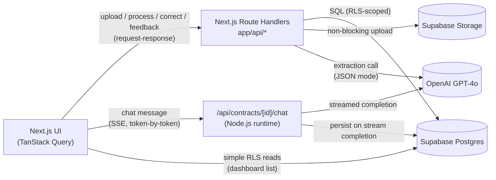

# ContractIQ — Comprehensive Implementation Specification

**Status:** Consolidated master reference. Generated per `skills/implementation-specs/SKILL.md` from `docs/engineering/engineering-doc.md` and the ContractIQ PRD (`docs/ContractIQ_PRD.md`, v1.0).
**Relationship to other docs:** This file merges and cross-references the granular per-feature specs already in `docs/specs/` (`auth-and-routing.md`, `contract-upload-and-extraction.md`, `ai-extraction-and-processing.md`, `key-terms-and-corrections.md`, `pdf-viewer.md`, `contract-chat.md`, `dashboard.md`, `feedback.md`, `state-management.md`, `api-conventions-and-error-handling.md`) and `supabase-schema.sql`. Those files remain the authoritative source for copy-paste code snippets; this document is the single comprehensive read-through covering **all** features, workflows, APIs, database design, frontend/backend implementation, edge cases, and acceptance criteria in one place.

---

## 1. Product Overview

**Product:** ContractIQ — an AI-assisted contract review tool that extracts key terms from NDAs and MSAs with page-level attribution and confidence scoring, and lets users ask follow-up questions about the contract in plain English.

**Problem it solves:** SMB founders, ops leads, and freelancers sign NDAs/MSAs without in-house legal support. Manual review takes 90–120 minutes and frequently misses key obligations. ContractIQ reduces this to ≤ 15 minutes with structured, verifiable output.

**Users:**
- **Primary — Time-Pressed Founder / Ops Lead:** 5–250 employee companies, no in-house legal, 5–15 NDAs/MSAs per month.
- **Secondary — Freelancer / Consultant:** 1–4 MSAs per month from clients, no leverage to negotiate.
- Both personas share identical permissions and workflows — no tiered access in MVP.

**Scope boundary (MVP):** NDA and MSA contracts only, English, US/UK law, text-layer PDFs ≤ 20 pages / 10 MB / ≤ 15,000 tokens. No scanned PDFs, no other contract types, no billing, no admin UI, no full-text search.

**Success metrics:** Upload-to-review ≤ 15 min (North Star); extraction F1 ≥ 88% (NDA) / ≥ 85% (MSA); confidence calibration ±10%; time-to-first-term ≤ 30s P95; 30-day retention ≥ 45%; cost/contract ≤ $0.25.

---

## 2. Technical Stack & Architecture Decisions

| Layer | Choice |
|---|---|
| Frontend | Next.js 14 (App Router), TypeScript, React, Tailwind CSS |
| Backend | Next.js Route Handlers (`app/api/*`), deployed on Vercel in the same project as the frontend |
| Database / Auth / Storage | Supabase (Postgres, Auth, Storage) |
| AI Provider | OpenAI GPT-4o (extraction: JSON mode, temp 0.1; chat: streaming, temp 0.4) |
| PDF Rendering | PDF.js (client) / `pdf-parse` (server, at upload time) |
| Server State | TanStack Query, exclusively |
| Client UI State | React Context / `useState` |
| Icons | Lucide React |

### Three architecture decisions that supersede the PRD's literal text

1. **Backend is Next.js Route Handlers, not Supabase Edge Functions.** The PRD hedged between the two; this is final.
2. **Server-state management is TanStack Query, exclusively.** Not specified in the PRD — net-new decision. See §10.
3. **Contract Chat streams via Server-Sent Events (SSE)** from a Route Handler, not Supabase Realtime (which the PRD's Section 6 text mentions but which is **not used anywhere** in this architecture). Persistence happens once the stream completes.

### Service Interaction Diagram



The chat path is the only one that streams incrementally and the only one whose DB write happens *after* the response starts rendering.

---

## 3. Folder Structure

```
app/
  (marketing)/page.tsx                          — landing page
  (auth)/login/page.tsx
  (auth)/signup/page.tsx
  (dashboard)/dashboard/page.tsx                 — summary card + contract history table
  (dashboard)/contracts/
    upload/page.tsx                              — upload screen + pre-processing preview
    [contractId]/page.tsx                        — results page (PDF viewer + key terms + chat)
  api/
    contracts/
      upload/route.ts
      [id]/
        custom-terms/route.ts
        process/route.ts
        key-terms/[termId]/route.ts
        chat/route.ts                            — SSE, Node.js runtime
        chat/messages/route.ts
        feedback/route.ts
        route.ts                                 — GET detail, DELETE
components/
  upload/         — UploadForm, ContractTypeSelector, CustomTermInput, ProcessingProgress
  key-terms/      — KeyTermsPanel, KeyTermRow, ConfidenceBadge, SourceSentenceTooltip
  pdf-viewer/     — PdfViewer, TextViewerFallback
  chat/           — ChatPanel, ChatMessageList, ChatMessageBubble, ChatInput
  dashboard/      — DashboardSummaryCard, ContractHistoryTable
  auth/           — AuthForm
  feedback/       — FeedbackWidget
  ui/             — shared design-system primitives (Button, Card, Badge, Tooltip)
lib/
  supabase/       — client.ts (browser), server.ts (server component / route handler client)
  openai/         — extraction.ts, chat.ts, withRetry.ts
  pdf/            — extractText.ts
  security/       — rate limiting, validation helpers (fleshed out in Stage 7)
  validation/     — shared Zod schemas
  constants/      — standardTerms.ts
  utils/          — apiError.ts, shared helpers
hooks/
  useContracts.ts, useDashboardStats.ts, useKeyTerms.ts, useChatMessages.ts,
  useUploadContract.ts, useAddCustomTerm.ts, useProcessContract.ts,
  useCorrectKeyTerm.ts, useSendChatMessage.ts, useSubmitFeedback.ts
providers/
  QueryProvider.tsx                              — TanStack Query client provider
  UIStateContext.tsx                              — chat panel visibility, active PDF page, modal state
types/
  contract.ts, keyTerm.ts, chatMessage.ts
middleware.ts                                     — Supabase session refresh + route protection
```

Naming conventions: route segments kebab-case, components PascalCase, hooks camelCase with `use` prefix, lib files camelCase, API routes REST plural nouns matching table names, DB tables snake_case plural, env vars SCREAMING_SNAKE_CASE.

---

## 4. Database Design

Full runnable DDL is in `docs/specs/supabase-schema.sql` — paste-and-run in the Supabase SQL Editor. Summary:

| Table | Key columns | Notes |
|---|---|---|
| `contracts` | `user_id`, `contract_name`, `contract_type` (NDA/MSA), `status` (uploaded/processing/completed/error), `file_path`, `contract_text`, `page_count`, `processing_error`, `detected_contract_type`, `last_accessed_at` | Indexes: `user_id`, `status`, `created_at`. `updated_at` trigger. |
| `custom_key_terms` | `contract_id`, `user_id`, `term_name` | `BEFORE INSERT` trigger rejects the 6th+ term per contract (a plain CHECK can't count sibling rows). |
| `key_terms` | `contract_id`, `user_id`, `term_name`, `value`, `page_number`, `confidence_score` (0–100), `source_sentence`, `is_manual`, `custom_key_term_id`, `is_edited`, `original_ai_value`, `edited_at` | Indexes: `contract_id`, `user_id`. `updated_at` trigger. |
| `chat_sessions` | `contract_id` (unique — 1:1 with contracts), `user_id` | `updated_at` trigger. |
| `chat_messages` | `session_id`, `user_id`, `role` (user/assistant), `content`, `citation_page`, `query_classification` (contract/history/both) | Index: `(session_id, created_at)`. |
| `user_feedback` | `contract_id`, `user_id`, `rating` (up/down), `comment` | |
| `term_corrections` (view, not a table) | `SELECT ... FROM key_terms WHERE is_edited = true` | `security_invoker = true` so RLS still applies through the view. |

**RLS:** every table has `user_id = auth.uid()` policies for all applicable operations — this is the **sole** authorization mechanism (no custom middleware layer).

**Storage:** private bucket `contracts`, path pattern `contracts/{user_id}/{contract_id}/{filename}.pdf`, RLS restricting `INSERT`/`SELECT`/`DELETE` on `storage.objects` to `auth.uid()::text = (storage.foldername(name))[1]`. Signed URLs expire after 1 hour.

**Forward-planned (Stage 7):** `rate_limit_events` table, not created here.

---

## 5. API Specification (Consolidated)

All routes are Next.js Route Handlers under `app/api/*` unless marked as a direct Supabase client read.

| Method & Path | Purpose | Auth | Runtime | Notes |
|---|---|---|---|---|
| `POST /api/contracts/upload` | Upload PDF, extract text, create contract | Required | Node.js | Multipart: `file` + `contract_type`. Validates ≤10MB/≤20pp/≥100 words server-side. Returns `{ contract_id, page_count, standard_term_list }`. |
| `POST /api/contracts/[id]/custom-terms` | Add a custom key term | Required | Node.js | Body `{ term_name }`. DB trigger rejects 6th+ term → `422`. |
| `POST /api/contracts/[id]/process` | Trigger GPT-4o extraction | Required | Node.js | Sets `status`, bulk-inserts `key_terms`. |
| `GET /api/contracts` | Dashboard contract list | Required | — | **Direct Supabase client read** (RLS-scoped), wrapped in TanStack Query. |
| `GET /api/contracts/[id]` | Contract detail + key terms + custom terms | Required | Node.js | Route Handler (joins multiple tables). |
| `PATCH /api/contracts/[id]/key-terms/[termId]` | Correct a term's value | Required | Node.js | Body `{ value }`. Must complete < 2s. Sets `is_edited`, `original_ai_value` (first edit only). |
| `POST /api/contracts/[id]/chat` | Send a chat message | Required | **Node.js** | SSE response. Body `{ message }`. Verifies ownership + `status = 'completed'`. |
| `GET /api/contracts/[id]/chat/messages` | Load persisted chat history | Required | Node.js | Used on page (re)load. |
| `POST /api/contracts/[id]/feedback` | Submit thumbs up/down + comment | Required | Node.js | Body `{ rating, comment? }`. |
| `DELETE /api/contracts/[id]` | Delete contract + all associated data | Required | Node.js | Cascades via FK; deletes Storage object first (non-blocking on failure). |

**Deferred to Phase 2:** `POST /api/contracts/[id]/export?format=csv|pdf` (US-011).

### Standard Error Envelope

```json
{ "error": { "code": "VALIDATION_ERROR", "message": "Human-readable message." } }
```

| HTTP Status | Code |
|---|---|
| `401` | `UNAUTHORIZED` |
| `404` | `NOT_FOUND` |
| `422` | `VALIDATION_ERROR` |
| `429` | `RATE_LIMITED` |
| `500` | `INTERNAL_ERROR` |

All request bodies validated with Zod **before** any DB or OpenAI call. Every route verifies `user_id = auth.uid()` explicitly (defense in depth on top of RLS). Full conventions in `docs/specs/api-conventions-and-error-handling.md`.

---

## 6. Feature Specifications

Each feature below states: user story + PRD acceptance criteria (verbatim), user flow, frontend implementation, backend/API implementation, database interaction, and edge cases.

### 6.1 Authentication (FR-01, US-001)

> *As a founder, I want to sign up with my email and password so that my contracts and chat history are saved privately.*
> **Acceptance criteria:** Auth flow completes within 10 seconds; user is redirected to Dashboard on success; invalid credentials return a clear error message.

**Flow:** Landing page → sign-up modal (email + password) → `supabase.auth.signUp()` direct from browser client → session cookie set via `middleware.ts` (`@supabase/ssr`) → redirect to `/dashboard`. Sign-in mirrors this with `signInWithPassword()`. Sign-out calls `supabase.auth.signOut()`, redirects to `/`.

**Frontend:** `app/(auth)/login/page.tsx`, `app/(auth)/signup/page.tsx`, `components/auth/AuthForm.tsx` (`'use client'`). Client-side validation: email format required, password ≥ 8 chars.

**Backend:** No custom Route Handler — Supabase Auth handles registration/login directly from the client SDK. `middleware.ts` protects `/dashboard/*` and `/contracts/*`, redirecting unauthenticated requests to `/login?redirectTo=<path>`.

**DB:** Supabase Auth creates rows in `auth.users` (managed by Supabase, not application-defined).

**Edge cases:** duplicate email → "An account with this email already exists. Sign in instead?"; wrong password → "Invalid email or password."; session expiry mid-session → redirect to `/login` with `redirectTo`, return to original path after re-auth.

Full detail: `docs/specs/auth-and-routing.md`.

---

### 6.2 Dashboard (FR-10, US-008)

> *As a user, I want my dashboard to show all the contracts I've reviewed so that I have a record of my review history.*
> **Acceptance criteria:** Dashboard displays contract name, type, date uploaded, and review status; clicking any row opens the results page for that contract.

**Flow (new user):** Lands on `/dashboard` → `['contracts']` query returns 0 rows → empty state: **"No contracts reviewed yet — upload your first contract to begin"** + "Review a Contract" CTA.
**Flow (returning user):** `['contracts', userId]` and `['dashboardStats', userId]` fetch in parallel, cached until invalidated → `DashboardSummaryCard` (total + NDA/MSA breakdown) + `ContractHistoryTable` (last 5, sortable by date/name/type).

**Frontend:** `app/(dashboard)/dashboard/page.tsx`, `components/dashboard/DashboardSummaryCard.tsx`, `components/dashboard/ContractHistoryTable.tsx`. Status colors per design system (`Completed #16A34A`, `Processing #F59E0B`, `Failed #DC2626`, `Draft #64748B`). Client-side sort on already-fetched data.

**Backend:** Direct Supabase client reads (RLS-scoped) — no Route Handler, since this is simple CRUD with no OpenAI involvement.

**DB:** `SELECT ... FROM contracts WHERE user_id = auth.uid() ORDER BY created_at DESC`.

**Edge cases:** upload invalidates `['contracts']` and `['dashboardStats']`; processing invalidates `['contracts']` (status transitions).

Full detail: `docs/specs/dashboard.md`.

---

### 6.3 Contract Upload & Text Extraction (FR-02, FR-03, FR-05, US-002, US-005)

> **US-002:** *As a user, I want to upload a PDF contract and see the key terms extracted automatically so that I don't have to read the whole document line by line.*
> **Acceptance criteria:** PDF upload accepts files up to 10 MB; extraction completes within 30 seconds P95 for ≤ 20 pages; key terms panel shows ≥ 80% of standard NDA/MSA terms with values.
>
> **US-005:** *As a user, I want to add a custom key term before processing so that I can get values for clauses specific to my situation.*
> **Acceptance criteria:** Custom terms appear in the pre-processing preview; processed results include custom term extraction with the same structure (value, page, confidence).

**Flow:** Select contract type (NDA/MSA) → drag/drop or pick PDF (client validates ≤10MB before upload) → `POST /api/contracts/upload` → pre-processing preview shows the standard term list → optionally add up to 5 custom terms (`POST /api/contracts/[id]/custom-terms`) → "Process Contract" triggers extraction (§6.4).

**Standard term lists (verbatim, PRD §4):**
- **NDA (10):** Parties, Effective Date, Confidentiality Obligations, Permitted Disclosures, Term & Duration, Governing Law, Jurisdiction, IP Ownership, Non-Solicitation, Breach & Remedy.
- **MSA (12):** Parties, Service Scope, Payment Terms, Invoice Schedule, Late Payment Penalty, Liability Cap, Indemnification, IP Ownership, Termination Clause, Governing Law, Dispute Resolution, Notice Period.

**Frontend:** `app/(dashboard)/contracts/upload/page.tsx`, `components/upload/{UploadForm,ContractTypeSelector,CustomTermInput,ProcessingProgress}.tsx`, `hooks/useUploadContract.ts` (multipart POST with progress UI), `hooks/useAddCustomTerm.ts` (optimistic).

**Backend:** `POST /api/contracts/upload` (Node.js runtime — file parsing needs Node APIs):
1. Validate `contract_type` and file size server-side (authoritative, not just client-side).
2. `lib/pdf/extractText.ts` runs `pdf-parse`, producing `[PAGE N]`-marked text (1-indexed, single source of truth for extraction and chat).
3. If extracted text < 100 words → `422` "Scanned PDFs are not supported yet", no contract row created.
4. `INSERT INTO contracts (...)` with `status = 'uploaded'`.
5. Non-blocking `Storage.upload()` — failure only sets `file_path = null`, does not fail the request.

`POST /api/contracts/[id]/custom-terms`: `INSERT INTO custom_key_terms`; the DB trigger enforces the 5-term cap, surfaced as `422`.

**DB:** `contracts` insert (§4); `custom_key_terms` insert per term.

**Edge cases:** file > 10MB/20pp → server-side `422` is authoritative even if client check is bypassed; Storage upload fails → contract still created, results page falls back to `TextViewerFallback`; 6th custom term → `422`, existing terms remain in the UI.

Full detail: `docs/specs/contract-upload-and-extraction.md`.

---

### 6.4 AI Extraction & Processing (FR-04, FR-11, US-004)

> *As a user, I want to see a confidence score for each extracted term so that I know which terms I should verify manually.*
> **Acceptance criteria:** Each term shows a confidence score (0–100%); scores < 50% show a warning icon and tooltip.

**Flow:** "Process Contract" → `useProcessContract` → `POST /api/contracts/[id]/process` → 3-step progress UI (extracting text → analysing with AI → compiling results) → on success, invalidates `['keyTerms']`/`['contracts']`, redirects to results page.

**Backend (Node.js):**
1. Preconditions: `status` must be `uploaded` or `error` (allows retry); else `409`.
2. `UPDATE contracts SET status = 'processing'`.
3. `lib/openai/extraction.ts` builds a few-shot prompt (3 NDA + 3 MSA labelled examples in the system prompt) with the standard term list + custom term names + full `contract_text`.
4. GPT-4o call: JSON mode, temperature `0.1`, max output tokens `2000`.
5. Zod-validate the response (`ExtractionResponseSchema`: `detected_contract_type` + `terms[]`). On parse failure, **one** automatic retry with the corrective prompt: *"Your previous response was not valid JSON. Return only the JSON array, no explanation."*
6. Bulk `INSERT INTO key_terms` — one row per term (standard: `is_manual=false`; custom: `is_manual=true`, `custom_key_term_id` set).
7. Success: `status = 'completed'`, `detected_contract_type` set. Failure after retry / 3 OpenAI retries (1s/2s/4s backoff): `status = 'error'`, `processing_error` set, `500` with "Try again in a few minutes" CTA.

**Confidence bands (display only — the FR-11 rule is `< 50%`, exact regardless of band boundaries):**

| Range | Color |
|---|---|
| 90–100% | `#16A34A` |
| 70–89% | `#84CC16` |
| 50–69% | `#F59E0B` |
| < 50% | `#DC2626` |

**Edge cases:** malformed JSON twice → `status = 'error'`, retry CTA re-triggers the same endpoint; `detected_contract_type` mismatch → non-blocking soft warning banner, extraction still proceeds; zero terms extracted → still `completed`, empty-state panel, not treated as an error.

Full detail: `docs/specs/ai-extraction-and-processing.md`.

---

### 6.5 Key Terms Panel & Inline Correction (FR-04, FR-11, US-003, US-004, US-009)

> **US-003:** *As a user, I want to see which page each key term was found on so that I can verify the extraction myself.* Acceptance: each term displays a page number; clicking scrolls the PDF viewer to that page.
> **US-009:** *As a user, I want to edit an incorrectly extracted term so that the record is accurate.* Acceptance: inline edit saves within 2 seconds; edited terms show an "Edited" badge; original AI value is stored separately.

**Frontend:** `components/key-terms/{KeyTermsPanel,KeyTermRow,ConfidenceBadge,SourceSentenceTooltip}.tsx`. Standard terms first (in `STANDARD_TERMS` order), then custom terms ("Custom" badge). Each row: term name, value, page number (clickable → sets `targetPage`), confidence badge, "Why?" expander showing `source_sentence` verbatim.

**FR-11 hard rule:** confidence `< 50` → non-dismissible ⚠️ tooltip: *"Low confidence — we recommend verifying this in the document directly."* Term is **never hidden**.

**Inline correction:** click-to-edit → `useCorrectKeyTerm` optimistically patches `['keyTerms', contractId]` → `PATCH /api/contracts/[id]/key-terms/[termId]` → rollback on error.

**Backend:** `PATCH` route, < 2s requirement (single-row update, no OpenAI call):
```sql
UPDATE key_terms
SET value = $1, is_edited = true,
    original_ai_value = CASE WHEN is_edited = false THEN value ELSE original_ai_value END,
    edited_at = now()
WHERE id = $2 AND user_id = auth.uid()
```
`original_ai_value` pinned to the **first** edit only.

**Edge cases:** re-editing an already-edited term doesn't overwrite `original_ai_value`; empty-string edit blocked client + server side (`422`); confidence exactly `50` is not flagged (strictly `< 50`).

Full detail: `docs/specs/key-terms-and-corrections.md`.

---

### 6.6 PDF Viewer & Text Viewer Fallback (FR-06, FR-07, US-003, US-006)

> *As a user, I want to see a preview of the PDF within the app so that I don't have to switch between windows while reviewing.*
> **Acceptance criteria:** PDF viewer renders all pages; user can scroll, zoom in/out; highlighted term references are clickable.

**Selection logic:** `contract.file_path` set → `PdfViewer`; else → `TextViewerFallback`. Both accept the same `targetPage` prop from `UIStateContext`, written by key-term clicks, confidence-badge clicks, and chat citation clicks.

**`PdfViewer`:** signed URL (1hr expiry) from Supabase Storage, rendered with `pdfjs-dist` to `<canvas>` per page. On signed-URL expiry mid-session, silently re-fetch once before showing an error.

**`TextViewerFallback`:** parses `[PAGE N]` markers from `contract_text` via regex, renders each as a labelled `<section id="page-N">`, `scrollIntoView` on `targetPage` change.

**Edge cases:** `file_path = null` → always `TextViewerFallback`, this is expected degraded behavior, not an error state; `targetPage` beyond `page_count` → clamp, don't throw; blank/short pages still render (page numbers must line up 1:1 with `key_terms.page_number` and chat citations).

Full detail: `docs/specs/pdf-viewer.md`.

---

### 6.7 Contract Chat (FR-08, FR-09, US-007, US-012)

> **US-007:** *As a user, I want to chat with my contract in plain English so that I can ask specific questions without searching manually.* Acceptance: chat responds within 15 seconds; responses are grounded in the uploaded document text; each response cites a page number.
> **US-012:** *As a user, I want the chat history for each contract to persist so that I can revisit my questions later.* Acceptance: chat messages are stored in Supabase; reopening a contract's results page loads the previous chat session.

**Flow:** "Chat with Contract" button → `ChatPanel` opens as a sidebar tab → `useChatMessages` loads persisted history → user submits a question → optimistic append → SSE connection to `POST /api/contracts/[id]/chat` → token deltas render incrementally → on `done`, TanStack Query reconciles with the persisted row → response shows "Source: Page X" citation, clickable.

**Backend (`export const runtime = 'nodejs'` — required for the OpenAI streaming SDK):**
1. Verify `status = 'completed'`; else `422`.
2. Find/create `chat_sessions` row (1:1 with `contract_id`).
3. `SELECT ... LIMIT 200` ascending history.
4. `classifyQuery()` — heuristic, **no extra LLM call** — returns `contract | history | both`.
5. Build RAG prompt: full `contract_text` + history + system prompt *"Answer only from the document text provided. If the answer is not in the document, say so."* Mandatory `[Page X]` citation.
6. GPT-4o `stream: true`, temp `0.4`, max `1000` tokens. Relay token deltas as SSE `event: delta`.
7. On completion: parse `[Page X]` citation, **one write** inserting both user and assistant `chat_messages` rows. DB is never written mid-stream.

**Hallucination guardrails:** document-only system prompt; "I cannot find this in the document" is a valid, expected response — not an error, not retried; mandatory citation; automated regression test asserts the "cannot find" response for out-of-document questions.

**Edge cases:** chat entry point disabled until `status = 'completed'`; question needing chat history → `classifyQuery` shifts prompt weighting; SSE drop mid-stream → "Connection lost — retry" affordance, no partial message persisted (persistence only on `done`).

Full detail: `docs/specs/contract-chat.md`.

---

### 6.8 Feedback (FR-12, US-010, P2)

> *As a user, I want to submit feedback on the AI's accuracy so that the product improves over time.*
> **Acceptance criteria:** A thumbs up / thumbs down rating and optional text comment is available on the results page; feedback is saved to `user_feedback` table.

**Frontend:** `components/feedback/FeedbackWidget.tsx`. Thumbs down reveals an optional comment textarea before submit. Confirmation shown post-submit; UI blocks duplicate submissions per contract per session (no DB uniqueness constraint — not specified by the PRD).

**Backend:** `POST /api/contracts/[id]/feedback` — `INSERT INTO user_feedback (contract_id, user_id, rating, comment)`.

**Edge cases:** comment without rating blocked client-side; feedback allowed even while contract is still `processing` (feedback is about the review experience generally, not gated on status).

Full detail: `docs/specs/feedback.md`.

---

### 6.9 Contract Deletion (part of FR-13)

`DELETE /api/contracts/[id]`: delete Storage object first (log-and-continue on failure — an orphaned Storage object is a cleanup concern, not a user-facing failure), then `DELETE FROM contracts` — cascades to `key_terms`, `custom_key_terms`, `chat_sessions` → `chat_messages`, `user_feedback` via `ON DELETE CASCADE`. Returns `204`.

---

## 7. Functional Requirements Traceability

| ID | Requirement | Priority | Implementation |
|---|---|---|---|
| FR-01 | Sign up/in/out via Supabase Auth | P0 | §6.1 |
| FR-02 | Accept PDF ≤ 10MB/20pp, reject outside limits | P0 | §6.3 |
| FR-03 | Extract text once at upload with `[PAGE N]` markers, reused by extraction + chat | P0 | §6.3 |
| FR-04 | Key terms panel: Term Name, Value, Page Number, Confidence Score | P0 | §6.5 |
| FR-05 | ≥ 5 custom key terms before processing, same structure as standard | P0 | §6.3 |
| FR-06 | Results page always shows content — PDF viewer or text fallback | P1 | §6.6 |
| FR-07 | Page reference click scrolls viewer to that page | P1 | §6.5, §6.6 |
| FR-08 | Chat sends question + full contract text to OpenAI, grounded response | P1 | §6.7 |
| FR-09 | All chat messages saved to Supabase with role + timestamp | P1 | §6.7 |
| FR-10 | Dashboard: total reviewed, breakdown by type, sortable list | P1 | §6.2 |
| FR-11 | Confidence < 50% shows warning, term never hidden | P0 | §6.4, §6.5 |
| FR-12 | Thumbs up/down + optional comment | P2 | §6.8 |
| FR-13 | All tables in one Supabase project with RLS | P0 | §4 |
| FR-14 | Complete DB setup as one paste-and-run SQL file | P0 | `docs/specs/supabase-schema.sql` |

## 8. User Story Acceptance Criteria (verbatim, PRD Section 4)

| ID | User Story | Acceptance Criteria | Priority |
|---|---|---|---|
| US-001 | Sign up with email/password so contracts and chat history are saved privately | Auth flow completes within 10 seconds; redirected to Dashboard on success; invalid credentials return a clear error | P0 |
| US-002 | Upload a PDF and see key terms extracted automatically | Upload accepts ≤10MB; extraction ≤30s P95 for ≤20 pages; key terms panel shows ≥80% of standard NDA/MSA terms with values | P0 |
| US-003 | See which page each key term was found on | Each term displays a page number; clicking scrolls the PDF viewer to that page | P0 |
| US-004 | See a confidence score per extracted term | Each term shows 0–100%; scores <50% show a warning icon and tooltip | P0 |
| US-005 | Add a custom key term before processing | Custom terms appear in the pre-processing preview; results include custom term extraction with the same structure | P0 |
| US-006 | See a PDF preview within the app | Viewer renders all pages; scroll/zoom; term references clickable | P1 |
| US-007 | Chat with the contract in plain English | Responds within 15s; grounded in document text; cites a page number | P1 |
| US-008 | Dashboard shows all reviewed contracts | Displays name, type, date, status; clicking a row opens results | P1 |
| US-009 | Edit an incorrectly extracted term | Inline edit saves within 2s; "Edited" badge shown; original AI value stored separately | P1 |
| US-010 | Submit feedback on AI accuracy | Thumbs up/down + optional comment on results page; saved to `user_feedback` | P2 |
| US-011 | Export key terms as CSV/PDF | Deferred to Phase 2 — generates and downloads within 5s | P2 |
| US-012 | Persistent chat history per contract | Messages stored in Supabase; reopening loads previous session | P1 |

---

## 9. Hallucination & AI Guardrails (Section 9 of engineering doc)

- Confidence color-coding (§6.4 table).
- Non-dismissible tooltip on any term < 50% confidence; terms never hidden.
- Every term must carry a `source_sentence`; a term without one is treated as unreliable (schema enforces `min(1)`).
- Deterministic extraction settings: temperature 0.1, JSON mode enforced.
- Monthly calibration monitoring; UI warning if eval reveals ≥15% miscalibration.
- Chat: document-only system prompt, mandatory `[Page X]` citation, automated regression test asserting "I cannot find this" for out-of-document questions.

---

## 10. State Management

Full detail in `docs/specs/state-management.md`. Summary:

| Query Key | Purpose |
|---|---|
| `['contracts', userId]` | Dashboard contract list |
| `['dashboardStats', userId]` | Summary counts by type |
| `['contract', contractId]` | Single contract detail |
| `['keyTerms', contractId]` | Extracted + custom key terms |
| `['customKeyTerms', contractId]` | Custom term list pre-processing |
| `['chatMessages', sessionId]` | Persisted chat history |

Mutations: `useUploadContract`, `useAddCustomTerm`, `useProcessContract`, `useCorrectKeyTerm` (optimistic, rollback), `useSubmitFeedback`, `useSendChatMessage` (SSE-aware).

Client-only UI state (never TanStack Query): chat panel open/closed, active PDF `targetPage`, modal open/closed, upload/processing progress indicator.

---

## 11. Testing Strategy

- **Unit (Vitest):** `lib/openai/*` prompt builders, `lib/pdf/extractText.ts` (page-marker correctness), Zod validators. Target 80% coverage on `lib/`.
- **Integration:** API routes against a local/test Supabase instance — upload→extract, process→key_terms write, correction PATCH (<2s), chat SSE round-trip, feedback write.
- **E2E (Playwright):** Flow A (signup→dashboard), Flow C (upload→extract→results), US-009 (inline correction), Flow D (chat Q&A with citation assertion), feedback submission.
- **AI-specific evaluation (run in CI, not manual):** CUAD dataset + 30 labelled NDA + 20 labelled MSA contracts on every release — targets ≥88% F1 (NDA), ≥85% F1 (MSA), ≥92% page-attribution accuracy, ≥80% F1 custom-term extraction. Monthly calibration check (±10%). Automated hallucination regression test.

---

## 12. Out of Scope (MVP)

Scanned/OCR PDFs, non-English/non-US-UK contracts, contract types beyond NDA/MSA, CSV/PDF export (→ v1.1), batch upload (→ v1.1), dashboard analytics charts (→ v1.1), contract comparison (→ v1.2), multi-user/team workspaces (→ v1.2), email notifications (→ v1.2), billing/plan-tier enforcement, admin/internal support UI, full-text search, Supabase Realtime (superseded by SSE for chat).

---

## 13. Consolidated Assumptions

1. Rate limits (Stage 7): Auth 10/min, Chat 30/min, Processing 5/hr, Upload 20/day.
2. OpenAI cost-alert budget: $300/month, alert at $240 (80%).
3. Retry backoff: 1s / 2s / 4s (extraction and chat OpenAI calls).
4. Chat streaming uses SSE, not Supabase Realtime.
5. `chat_sessions` is 1:1 with `contracts`.
6. `term_corrections` logging is first-party analytics under the ToS, not a separate consent UI.
7. Contract-type mismatch detection is an extra field on the same extraction call (`detected_contract_type`), not a second model call.
8. Chat route runtime is Node.js, not Edge.
9. No admin/support role or UI exists in MVP.
10. No billing/plan-tier enforcement in MVP.
11. No full-text search — only a sortable dashboard list.
12. Export (US-011) generation mechanism (client vs. server) undecided, deferred to Phase 2.
13. 90-day retention auto-deletion via a scheduled `pg_cron` job (mechanism not specified in the PRD, to be implemented when built).

---

## 14. Cross-Reference Index

| Concern | File |
|---|---|
| Database schema (runnable SQL) | `docs/specs/supabase-schema.sql` |
| Environment variables | `.env.example` |
| Auth & routing | `docs/specs/auth-and-routing.md` |
| Upload & text extraction | `docs/specs/contract-upload-and-extraction.md` |
| AI extraction & processing | `docs/specs/ai-extraction-and-processing.md` |
| Key terms & corrections | `docs/specs/key-terms-and-corrections.md` |
| PDF viewer & fallback | `docs/specs/pdf-viewer.md` |
| Contract chat (SSE) | `docs/specs/contract-chat.md` |
| Dashboard | `docs/specs/dashboard.md` |
| Feedback | `docs/specs/feedback.md` |
| State management | `docs/specs/state-management.md` |
| API conventions & error handling | `docs/specs/api-conventions-and-error-handling.md` |
| Design system (colors, type, spacing, components) | `skills/design-system/SKILL.md` |
| Security controls (Stage 7) | *to be created:* `docs/security/security-plan.md` |
